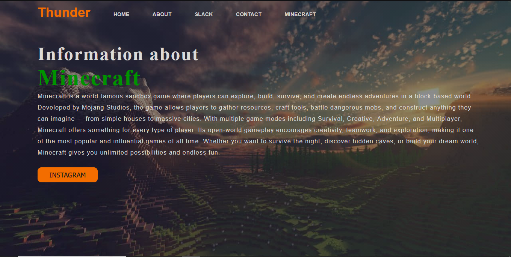

# Minecraft Website

A website made to give basic information about Minecraft strctures and recipies.

After opening the website there are my social media accounts and there is a MINECRAFT tab in navbar to go to the minecraft page.

Built using plain HTML. CSS.

This is my first project to learn web tech and join Hack Club YSWS events and its incomplete for some reason ill update it later but i mainly need 5-6 PIPES for shop (;

Please let me know how can I improve and grow further :)

My brother was making a website infront of me and i thought i should make it too.
